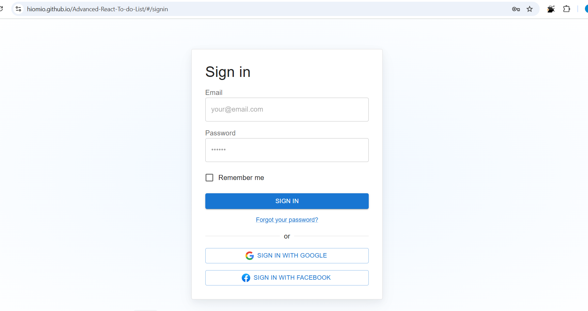

  

# 📝 Advanced React To-Do Application with Weather Integration

> **Enhancing Productivity with Real-Time Weather Updates**

  

---

  
  
  
  
  
  
  

---

## 🌟 Project Overview

The **Advanced React To-Do Application with Weather Integration** is a feature-rich task management tool designed to enhance productivity. By integrating real-time weather data using the OpenWeatherMap API, this application offers users contextual information, allowing them to plan tasks more effectively based on current weather conditions.

## 🚀 Features

- **Task Management**: Add, view, edit, and delete tasks effortlessly.
- **Task Prioritization**: Assign priorities (High, Medium, Low) to tasks for better organization.
- **Weather Integration**: Fetch and display current weather conditions for task locations using the OpenWeatherMap API.
- **User Authentication**: Secure login and logout functionalities using mock authentication.
- **Persistent Storage**: Tasks and authentication status are saved using local storage, ensuring data persistence across sessions.
- **Responsive Design**: Optimized for mobile, tablet, and desktop devices using Material-UI's responsive grid system.

---

## 🖼️ Screenshots

### 🏠 Home Page

  

### ➕ Add Task

  

  

### 🌤️ Weather Integration

  

### 🔑 User Authentication

  

---

## 🛠️ Technologies Used

| Technology | Description |
|------------|-------------|
|  | JavaScript library for building user interfaces |
|  | State management library |
|  | React UI framework for responsive and modern design |
|  | Programming language for web development |
|  | Markup language for structuring web content |
|  | Style sheet language for designing web pages |
|  | API for accessing current weather data |

---

