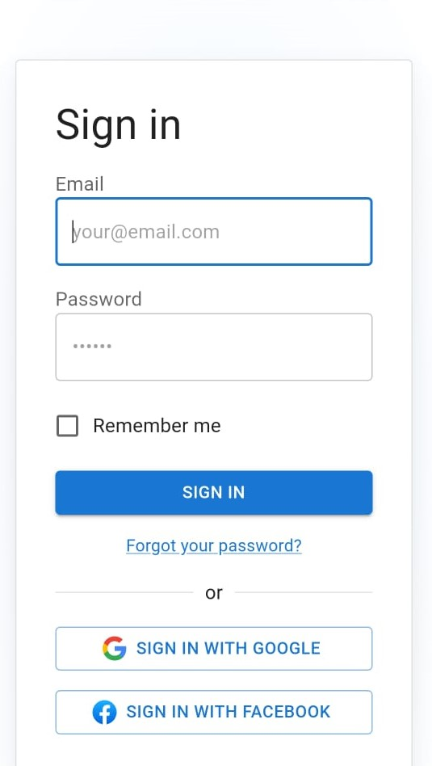

# 🌟 Advanced React To-Do Application with Weather Integration

<div align="center">
  
</div>

> **Boost productivity with real-time weather updates and efficient task management.**

<p align="center">
  
</p>

---

## 🚀 Features

✅ **Task Management:** Add, edit, delete, and organize tasks efficiently.  
✅ **Task Prioritization:** Assign High, Medium, or Low priority to tasks.  
✅ **Weather Integration:** Get real-time weather updates for task locations.  
✅ **User Authentication:** Secure login and logout system.  
✅ **Persistent Storage:** Saves tasks and authentication status across sessions.  
✅ **Responsive Design:** Optimized for mobile, tablet, and desktop using Material-UI.  

---

## 🖼️ Screenshots

### 🏠 Home Page
<p align="center">
  
</p>

### ➕ Add Task
<p align="center">
  
</p>

### 🌤️ Weather Integration
<p align="center">
  
</p>

### 🔑 User Authentication
<p align="center">
  
</p>

#### 📱 Mobile View
<p align="center">
  
</p>

<p align="center">
  
</p>


---

## 🛠️ Technologies Used

| Technology    | Description |
|--------------|-------------|
|  | JavaScript library for UI development |
|  | State management tool |
|  | UI framework for modern design |
|  | Programming language |
|  | Fetches real-time weather data |

---

## 🔧 Setup Instructions

### Prerequisites
- **Node.js** (v16 or later) and npm installed.
- **Weather API Key** from [WeatherAPI](https://www.weatherapi.com/).

### Installation Steps
```sh
# Clone the repository
git clone https://github.com/Hiomio/Advanced-React-To-do-List.git
cd advanced-react-todo-app

# Install dependencies
npm install

# Update API Key in services/api.js

# Start the application
npm start
```
The app will run at [http://localhost:3000](http://localhost:3000).

---

## ✅ Usage

### 📌 To-Do Features
- Add, delete, and prioritize tasks.
- Toggle between active and completed tasks.
- Tasks persist across sessions.

### 🌤️ Weather Widget
- Detects user's location and displays a 3-day weather forecast.
- Search for weather conditions in any city.

### 🔐 Authentication
- Secure login/logout system.
- Access and manage tasks only when logged in.

**Mock Credentials:**  
📧 Email: `user@example.com`  
🔑 Password: `password123`  

---

## 🧪 Running Tests
To execute tests, run:
```sh
npm test
```

---

## 🤝 Contributing
Contributions are welcome! Feel free to submit issues or pull requests.

---

## 📄 License
This project is licensed under the **MIT License**.

---

### 💡 Developed by [Hiomio](https://github.com/Hiomio)
## Deployed Link
[Click here to view the deployed application](https://hiomio.github.io/Advanced-React-To-do-List/)
🚀 Happy Coding!

